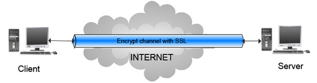

With an unencrypted connection between the MySQL client and the server, someone with access to the network could watch all your traffic and inspect the data being sent or received between client and server

When you must move information over a network in a secure fashion, an unencrypted connection is unacceptable. To make any kind of data unreadable, use encryption. Encryption algorithms must include security elements to resist many kinds of known attacks such as changing the order of encrypted messages or replaying data twice.

[MySQL](https://www.postgresql.org/docs/13/ssl-tcp.html#SSL-SETUP) supports encrypted connections between clients and the server using the TLS (Transport Layer Security) protocol. TLS is sometimes referred to as SSL (Secure Sockets Layer) but MySQL does not actually use the SSL protocol for encrypted connections because its encryption is weak.

[PostgreSQL](https://www.postgresql.org/docs/13/ssl-tcp.html#SSL-SETUP) has native support for using SSL connections to encrypt client/server communications for increased security.

