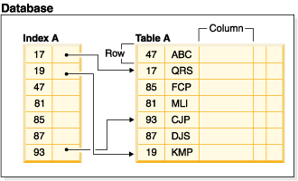
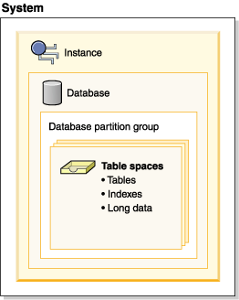

An **index** is an optional structure, associated with a table or table cluster.

Index are used to:
- Improve performance. In most cases, access to data is faster with an index. Although an index cannot be created for a view, an index created for the table on which a view is based can sometimes improve the performance of operations on that view.
- Ensure uniqueness. A table with a unique index cannot have rows with identical keys.

As data is added to a table, it is appended to the bottom (unless other actions have been carried out on the table or the data being added). There is no inherent order to the data. When searching for a particular row of data, each row of the table from first to last must be checked. Indexes are used as a means to access the data within the table in an order that might otherwise not be available.

Typically, when you search for data in a table, you are looking for rows with columns that have specific values. A column value in a row of data can be used to identify the entire row. For example, an employee number would probably uniquely define a specific individual employee. Or, more than one column might be needed to identify the row. For example, a combination of customer name and telephone number. Columns in an index used to identify data rows are known as keys. A column can be used in more than one key.

An index is ordered by the values within a key. Keys can be unique or non-unique. Each table should have at least one unique key; but can also have other, non-unique keys. Each index has exactly one key. For example, you might use the employee ID number (unique) as the key for one index and the department number (non-unique) as the key for a different index.

Ref: [postgres 13](https://www.postgresql.org/docs/13/indexes.html) , [mysql 8](https://dev.mysql.com/doc/refman/8.0/en/optimization-indexes.html)