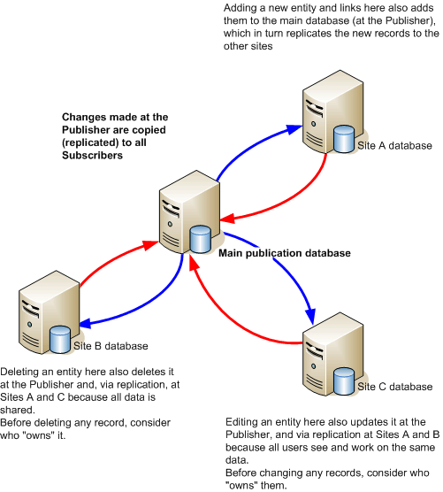

**Replication** is the process of copying data from a central database to one or more databases.

The central database is called the publication database because it provides the data for users at other sites. The data in the publication database is copied (replicated) to subscription databases at other locations. All users whether connected to the publisher server (the Publisher) or to a server at one of the remote sites (a Subscriber) see the same data and work on the same records. A Subscriber can be a Subscriber such as a file server or a disconnected Subscriber such as a laptop.

A change that is made in one subscription database is copied to the Publisher (merged), and the Publisher then replicates that change to the other Subscribers. On fixed Subscribers, this is a continuous process and you are not aware of it happening, synchronization usually occurs in a matter of seconds. The effect is that all users on fixed Subscribers have an almost identical view of the data even though they are working on different databases.

This figure shows the main database that is configured as the publication database with three subscription databases on servers that have permanent (fixed) connection to the Publisher:

Replication is a solution if your organization needs to:
- Copy and distribute data to one or more sites.
- Distribute data changes to other servers.
- Allow multiple users and sites to change and then merge the data modifications together, identifying and resolving conflicts if they occur.

Organizations that can benefit from replication include:

- Organizations with geographically distinct groups of users who need to share common data.
- Organizations that operate separate iBase databases to overcome practical restrictions that are imposed by iBase when large numbers of users simultaneously access the database.

Replication can also be used to store data redundantly so that part of the organization can continue operating if one or more of the servers or communication links fail. To take advantage of this feature, users need to be able to log on to a remote server.

Ref: [postgres 13](https://www.postgresql.org/docs/13/high-availability.html) , [mysql 8](https://dev.mysql.com/doc/refman/8.0/en/replication.html)